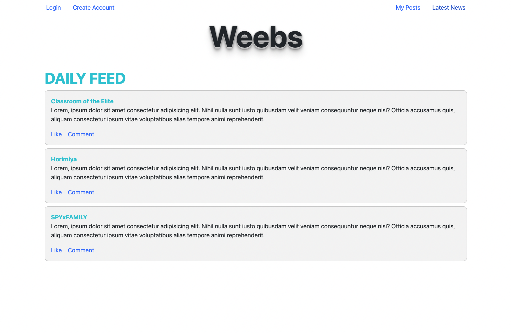

# Weebs - A one stop web forum for anime fanatics

## How the application looks like

## Motivation

This project is a web forum for anime fanatics. It is a place where anime fanatics can come together and discuss about their favorite anime. It is the perfect place for anime fanatics to share their thoughts and opinions under one roof.

## Features

User can:

- Create an account
- Log in
- Create a post
- Comment on a post
- Like a post
- View all posts
- View the posts that they have created

## Setup

To begin the project locally:

1. Clone this project

2. Navigate to web-forum-frontend
3. Run npm install to download the dependencies
4. Set up your .env file with REACT_APP_BACKEND=http://localhost:8080

5. Navigate back to the root directory
6. Execute cd web-forum-back-end && docker-compose up -d
7. Then execute go run ./cmd/api && cd ../web-formum-front-end && npm start to start development build
